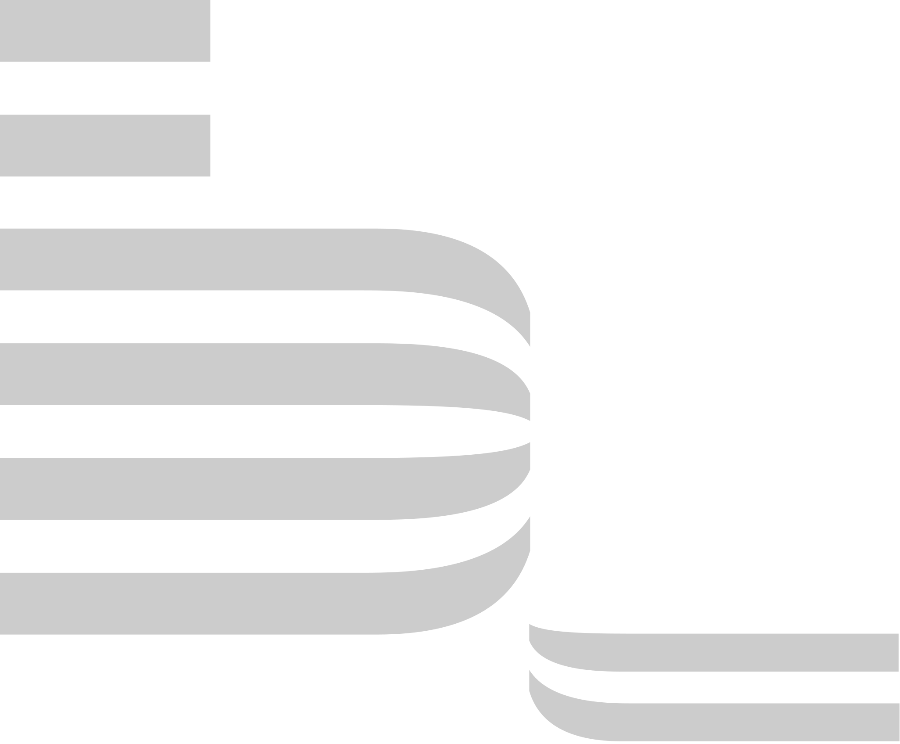

<!-- 
chore: readme
-->
<!-- 
   -->
>     
> 
> ⚙️ **Stack I'm gnawing on:**    
> 
> 
> 
> 
> 
> 
> 
> 
> 
> 
> <!-- 
>  -->
>
>
> 
>
> ☎ **My contacts:**  
> 
> 
> 
> 

      

<!-- 
   -->
<!-- 
   -->

  

<!-- 

  

 -->

<!--
**RUS29TAM/RUS29TAM** is a ✨ _special_ ✨ repository because its `README.md` (this file) appears on your GitHub profile.

Here are some ideas to get you started:

- 🔭 I’m currently working on ...
- 🌱 I’m currently learning ...
- 👯 I’m looking to collaborate on ...
- 🤔 I’m looking for help with ...
- 💬 Ask me about ...
- 📫 How to reach me: ...
- 😄 Pronouns: ...
- ⚡ Fun fact: ...

<code>

</code>

-->
